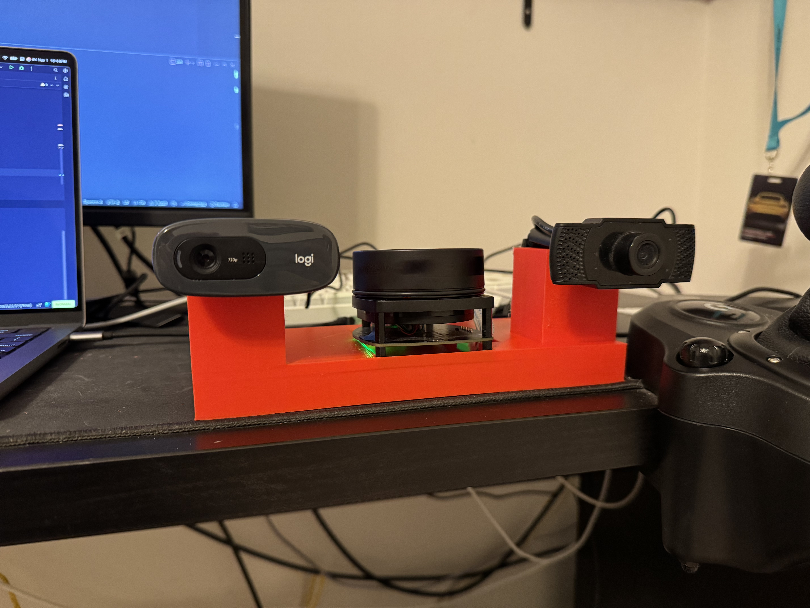

# Hybrid Stereo Autonomous Vehicle System
Road sign pose estimation for autonomous vehicles.

# Installation
## 1 - Requirements
1. [Cmake](https://cmake.org/)
2. [Python 3.12+](https://www.python.org/) (You probably will be able to get away with an older version of Python, but I've been developing on 3.12. pip is also required.)
3. [Git](https://git-scm.com/)
4. [CP210x USB to UART Bridge VCP Drivers](https://www.silabs.com/developers/usb-to-uart-bridge-vcp-drivers?tab=downloads)
5. [PyTorch](https://pytorch.org/) (Ultralytics will automatically install PyTorch but installing manually is recommended)
6. [Ultralytics](https://docs.ultralytics.com/) (Ultralytics will automatically be installed by setup scripts)

## 2 - Clone the Repository
```git clone --recursive https://github.com/NathanQ2/HybridStereoAutonomousVehicleSystem.git```

## 3 - Setup Virtual Environment
A virtual environment is generally recommended to prevent package version conflicts with other projects.
Note: on Linux, you may need to install the python venv package. (Debian Ex: ```sudo apt install python3.10-venv```)
```
sudo apt-get update && sudo apt-get upgrade -y
sudo apt install python[VERSION]-venv
```

### 3.1 - Windows/Mac/Linux
```
python3 -m venv venv
```

## 4 - Build RP_LiDAR_Interface_Cpp
### 4.1 - Download and Install the Appropriate Drivers
The [CP210x USB to UART Bridge VCP Drivers](https://www.silabs.com/developers/usb-to-uart-bridge-vcp-drivers?tab=downloads) are required to communicate with the LiDAR over USB.

### 4.2 - Build Using Cmake
```
cd HybridStereoAutonomousVehicleSystem
cd vendor/RP_LiDAR_Interface_Cpp
mkdir build
cd build
cmake ..
cmake --build .
cd ../../../
```

## 5 - Install Required Python Packages
```python3 -m pip install -r requirements.txt```

## 6 - Training the Model
At the moment, training configuration parameters can be edited in the [train.py](src/test/train.py) file. I trained with ```epochs=1000, device=[0], batch=-0.90``` and got alright results.

```python3 src/test/train.py```

## 7 - Run the [main.py](src/main/main.py) File!
### 7.1 - Windows
```python3 src/main/main.py [lidar com port Ex: com3]```

### 7.2 - Linux
```python3 src/main/main.py [lidar com port Ex: /dev/ttyUSB0]```

### 7.3 - Mac
```python3 src/main/main.py [lidar com port Ex: /dev/ttySLAB_USBtoUART]```

# How It Works
## Hardware
I chose to use two generic usb webcams in a stereo configuration with a baseline of ~190.5 millimeters. 
This allows us to do basic depth estimation using the difference between the two images.
Camera calibration constants can be found in the [rightCameraProperties.json](cameraCalib/rightCameraProperties.json) and the [leftCameraProperties.json](cameraCalib/leftCameraProperties.json) files respectively.
The other json files were generated by [calibdb.net](https://www.calibdb.net/#).
I've also chosen to use a [SLAMTEC RP LiDAR A1](https://www.slamtec.ai/product/slamtec-rplidar-a1/) rotating LiDAR for more accurate depth perception when available.


## Software
### Sign Detection
Sign detection is done using a pre-trained YOLOv8 model for each camera.