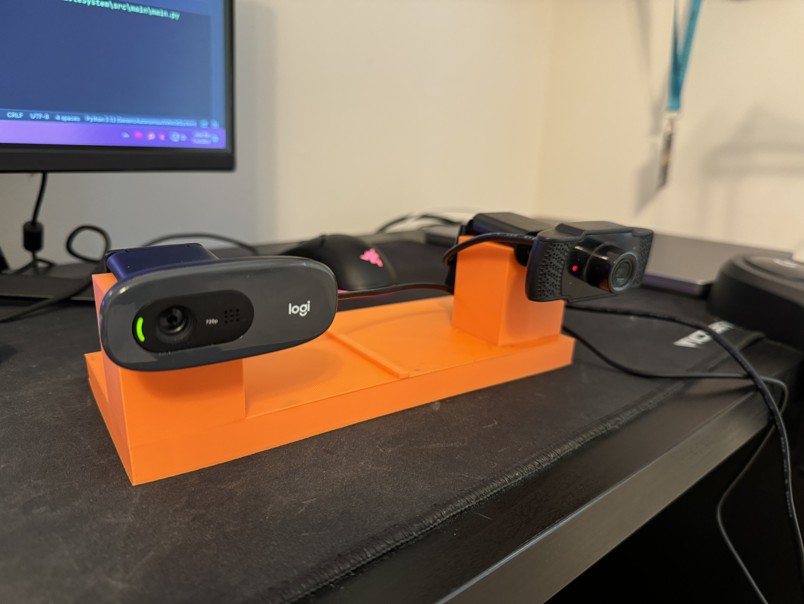

# Generic Autonomous Vehicle System
Pose estimation for autonomous vehicles using road signs. Not very user-friendly at the moment.

# Installation
## 1 - Clone the Repository
```git clone --recursive https://github.com/NathanQ2/HybridStereoAutonomousVehicleSystem.git```
## 2 - Build RP_LiDAR_Interface_Cpp
### 2.1 - Download and Install the Appropriate Drivers
The [CP210x USB to UART Bridge VCP Drivers](https://www.silabs.com/developers/usb-to-uart-bridge-vcp-drivers?tab=downloads) are required to communicate with the LiDAR over USB.
### 2.2 - Build Using Cmake
```
cd vendor/RP_LiDAR_Interface_Cpp
mkdir build
cd build
cmake ..
cmake --build .
```


# How It Works
## Hardware
I chose to use two generic usb webcams in a stereo configuration with a baseline of ~190.5 millimeters. 
This allows us to do basic depth estimation using the difference between the two images.
Camera calibration constants can be found in the [rightCameraProperties.json](cameraCalib/rightCameraProperties.json) and the [leftCameraProperties.json](cameraCalib/leftCameraProperties.json) files respectively.
The other json files were generated by [calibdb.net](https://www.calibdb.net/#).
I've also chosen to use a [SLAMTEC RP LiDAR A1](https://www.slamtec.ai/product/slamtec-rplidar-a1/) rotating LiDAR for more accurate depth perception when available.


## Software
### Sign Detection
Sign detection is done using a pre-trained YOLOv8 model for each camera.